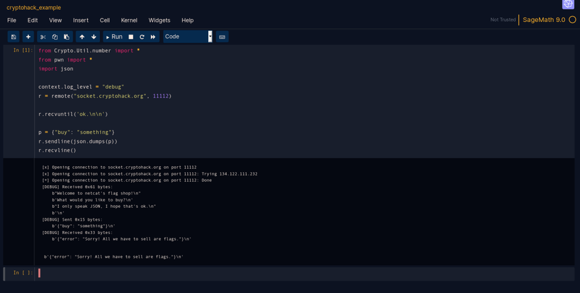

# CryptoHack Docker Container

A Jupyter notebook environment built for attacking crypto CTF challenges, with custom theming matching [CryptoHack](https://cryptohack.org).



The image comes with the following installed and integrated:
 - Sage 10
 - Pwntools
 - PyCryptodome
 - z3 Prover

## Installation

Download and run with:
```
docker run -p 127.0.0.1:8888:8888 -it hyperreality/cryptohack:latest
```
Then open 127.0.0.1:8888 in your browser.

## Notes

We map to 127.0.0.1 on the host rather than the default 0.0.0.0 as Jupyter token authentication was disabled for the sake of convenience.
